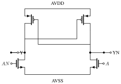

# REY_TR_SKY130A

Standard cell library for analog design, second generation. The library
is not for synthesis, but for the stray logic we sometimes need in
analog schematics.

Made with [ciccreator](https://github.com/wulffern/ciccreator) from the
sources in `cic/`. Regenerate with `cd work && make ip`.

## The rule that makes LVS pass

Every leaf cell needs a `TAPCELLB_CV` companion to be LVS clean — the
cells carry no well or substrate taps of their own, on purpose, so a
row of gates shares one tap. `REYTR_TOP` places every cell next to a
tap and is the cell CI checks.

## Cells

| Group | Cells |
|:--|:--|
| Inverters | IVX1, IVX2, IVX4, IVX8, BFX1 |
| Gates | NRX1, NDX1, ORX1..8, ANX1..8, **EOX1 (xor)**, EONX1 |
| Tristate | IVTRIX1, **IVTRICX1**, NDTRIX1, NRTRIX1 |
| Flip-flops | DFTSPCX1, DFRNQNX1, **DFQNX1** |
| Analog friends | SCX1 (schmitt), **LSX1 (level shifter core)**, SWX2, SWX4, TGX2, TGPD |
| Rails | TIEH, TIEL, TAPCELLB |
| Passives | RPPO2..16, RES2..16, CAPX1 |

Bold cells are new relative to jnw_tr_sky130a, ported from the
analogicus standard library (28FDSOI/65nm silicon) and from the
sun_pll sky130 PLL.

## The level shifter core

`LSX1_CV` is the cross coupled core only: the PCH pair sits in the
destination supply domain, the doubled NCH pull downs are driven by
the source domain. Make `AN` with an inverter in the source domain,
exactly like `sun_pll` does.

The schematic above is drawn with
[cictikz](https://github.com/wulffern/cictikz); the spec is
[assets/lsx1.cictikz.json](assets/lsx1.cictikz.json).

## Resistors

The poly resistors carry their own guard ring tied to `B`. The guard
standoff is 2.5 route grids — sky130 `poly.9` fails at 2, so this is
minimum. Adjacent resistors can share a guard wall by placing them
with `xoffset=-2.4`, as `REYTR_TOP` demonstrates: four resistors, five
guard walls instead of eight.

## Cell size, and why the cells are not smaller

Shrinking was tried and measured, and every road is closed:

- Trimming filler columns from the 18 column transistor pattern (one
  or two) moves the tap column, and the TOP power drops then cross
  cell-internal metal: **the two column trim shorted AVDD to AVSS**,
  DRC clean and invisible to hierarchical LVS. Only the flat LVS flow
  caught it. The pattern stays 18 columns.
- Route grids below 30/40 break the 0.17 um contact minimum (licon.1),
  and grids whose x1.2 multiples miss 50 dbu walk the resistors off
  the 5 nm grid.
- A square grid: 30/30 hits the same contact minimum, 40/40 grows
  every cell 33% in x. The rectangle is deliberate — vertical pitch
  carries the contact stack, horizontal only track spacing.

Smaller cells need a contact redesign, not a rule tweak.

## LVS: the flat flow

The leaf cells carry no taps on purpose, so hierarchical extraction
fails them on floating bulk. This repo uses the flat flow from
tech_sky130A (`LVSTCL=lvsflat.tcl` in `work/Makefile`): magic extracts
the whole tree with `ext2spice hierarchy off`, wells resolve against
the taps that are actually there, and cross-cell shorts are caught by
geometry. `make lvs CELL=REYTR_TOP` is the library's LVS gate and
reads "Circuits match uniquely".

## Capacitors

`CAPX1` is one rey transistor unit wide (88 800 nm) so capacitor rows
tile with transistor rows. There is no CAPX4; tile CAPX1 instead.
